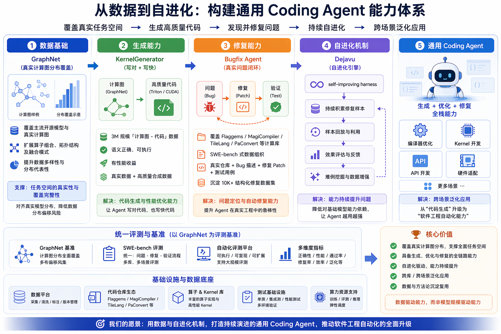

# GraphNet Agent 项目总结

> **TL;DR 精简版**：基于 Agent 自动化机制完成 82K+ 模型的计算图抽取，成功率约 68%。通过 CPU-only 模式 + 动态尺寸过滤 + 三阶段执行策略，系统性解决了规模化抽取中的稳定性与效率问题，为 Coding Agent 数据平台构建提供基础数据支撑。

---

## 一、OKR 目标

**目标**：Agent 累计抽取计算图 100k，抽取成功率不低于 80%。

---

## 二、项目背景

### 2.1 战略定位：Coding Agent 数据生产平台

构建可持续演进的 Coding Agent 能力体系：

| 层级 | 组件 | 核心能力 | 解决问题 |
|------|------|----------|----------|
| 1 | **GraphNet** | 真实计算图分布覆盖 | 任务是否真实、全面 |
| 2 | **KernelGenerator** | 写对 + 写快 | 代码生成与性能优化能力 |
| 3 | **Bugfix Agent** | 真实问题闭环 | 问题定位与自动修复能力 |
| 4 | **Dejavu** | 越用越强 | 能力持续提升问题 |

**最终 Outcome**：从"代码生成"升级为"软件工程自动化能力"，让 Agent 具备持续提升和跨场景泛化的能力：
- 具备 **生成 + 优化 + 修复** 的完整能力
- 支撑多场景：编译器优化、Kernel 开发、API 开发、硬件适配

### 2.2 本 OKR 背景与目标

GraphNet 计算图数据集的覆盖广度与抽取效率直接影响大模型在编译器融合与 Kernel 编写任务中的学习效果，需通过系统化模型引入与 Agent 自动化抽取实现 100k 级以上高质量数据构建。

**核心问题**：
1. **覆盖问题**：GraphNet 作为上游数据基础，若覆盖不足将导致子图结构模式分布偏差，难以刻画真实模型特征
2. **效率问题**：需引入 Agent 自动化抽取机制，支撑 500k 级规模数据构建

**可用数据来源**：
- TIMM：757 个模型
- Huggingface：278w 模型，可筛选出 100w 单机可运行的完整模型

---

## 三、项目整体进展

### 3.1 数据概况

| 指标 | 数值 |
|------|------|
| 累计抽取模型 | **82,268** |
| 成功率 | **~67.7%** |
| 已合入主干 PR | **8 项** |

> 注：因项目调整，实际数据规模与原始目标存在差异。

### 3.2 PR 进展

围绕 GraphNet Agent 的**可靠性、可观测性与运行效率**，完成 8 项改进并全部合入主干：

| # | PR 内容 | 核心改进 |
|---|---------|----------|
| [#713](https://github.com/PaddlePaddle/GraphNet/pull/713) | 新增辅助脚本与去重工具 | 日志分析、进度检查、SHA256 子图去重 |
| [#714](https://github.com/PaddlePaddle/GraphNet/pull/714) | 整理 Workspace 目录结构 | 成功/失败自动归档，统一子目录 |
| [#715](https://github.com/PaddlePaddle/GraphNet/pull/715) | 支持 CPU-only 模式 | `--cpu-workers` 纯 CPU 运行，适配无 GPU 场景 |
| [#716](https://github.com/PaddlePaddle/GraphNet/pull/716) | 修复多子图 hash 生成 | 统一单/多子图处理逻辑，复用 hash_util |
| [#718](https://github.com/PaddlePaddle/GraphNet/pull/718) | 添加下载硬超时保护 | `signal.alarm(120)` 防止下载无限阻塞 |
| [#719](https://github.com/PaddlePaddle/GraphNet/pull/719) | 模型参数量预估与动态过滤 | 超大模型分析阶段直接拒绝，避免数小时超时 |
| [#722](https://github.com/PaddlePaddle/GraphNet/pull/722) | 修复成功数统计逻辑 | 成功标记对齐实际输出，修正低估问题 |
| [#723](https://github.com/PaddlePaddle/GraphNet/pull/723) | 修复 worker 过早退出问题 | sentinel-based 关闭机制，确保模型全部处理 |

> 完整 PR 列表：[GitHub PRs](https://github.com/PaddlePaddle/GraphNet/pulls?q=is%3Apr+author%3Aluotao1+is%3Aclosed)

---

## 四、核心策略

### 4.1 策略概述

| 策略 | 说明 | 效果 |
|------|------|------|
| **CPU-only + 动态尺寸过滤** | 纯 CPU 运行，按内存自动计算模型尺寸上限 | 避免 GPU D-state 死锁，超大模型 2 秒内快速跳过 |
| **三阶段执行（无 llm-retry → 调参补跑 → llm-retry 修复）** | 先快速扫描获取"确定能成功"的模型，再针对性修复 | 速度提升 2~3 倍，节省 ~90% LLM Token |

### 4.2 策略一：CPU-only + 动态尺寸过滤

**背景**：GPU 模式受显存限制且存在 NVIDIA UVM 驱动导致的 D-state 死锁风险。

**实现**：
- 所有批次改为 CPU 执行
- `--max-model-size-b auto` 公式：`RAM × 0.7 / workers / 4`
- 示例：251GB × 0.7 / 12 / 4 ≈ 3.6B 参数上限

**效果**：
- CPU 单 worker 速度约为 GPU 的 1/5~1/3，但并发可开到 16~20
- 稳定性大幅提升，不再出现 GPU 模式下 7.5 小时无进展的卡死事故
- 超大模型在 `analyze()` 阶段即被拒绝，2 秒内快速跳过

### 4.3 策略二：三阶段执行（先跳过 llm-retry）

**背景**：Batch 7 第一轮启用 `--llm-retry` 后发现大量失败根因 LLM 根本修不了，导致速度慢、Token 消耗大。

**三阶段策略**：

| 阶段 | 策略 | 目标 |
|------|------|------|
| 第一阶段 | 快速扫描（无 llm-retry） | 用 `--max-model-size-b auto` 快速过滤，在最短时间内拿到"确定能成功"的模型集合 |
| 第二阶段 | 调参补跑（仍无 llm-retry） | 对 "Model too large" 的模型，调大 `--max-model-size-b` 统一补跑 |
| 第三阶段 | llm-retry 修复残留失败 | 只对 "Script execution failed" 类型用 `--llm-retry` 逐个修复 |

**收益**：
- 速度提升 2~3 倍（从 ~7 个/分钟提升至 ~21 个/分钟）
- 节省 ~90% LLM Token（从 ~3.2 亿降至 ~2,280 万）
- 失败原因清晰分类，便于制定针对性策略

---

## 五、相关文档与链接

| 文档 | 链接 |
|------|------|
| **全量模型抽取计划（详细执行方案与实验记录）** | [agent_full_run_plan.md](./agent_full_run_plan.md) |
| **Agent 模型抽取失败分析报告** | [agent_extraction_failures.md](./agent_extraction_failures.md) |
| **代码更新记录** | [develop...工作分支](https://github.com/PaddlePaddle/GraphNet/compare/develop...luotao1:GraphNet:luotao-fangfangssj-agent?expand=1) |
| **完整 PR 列表** | [GitHub PRs](https://github.com/PaddlePaddle/GraphNet/pulls?q=is%3Apr+author%3Aluotao1+is%3Aclosed) |
